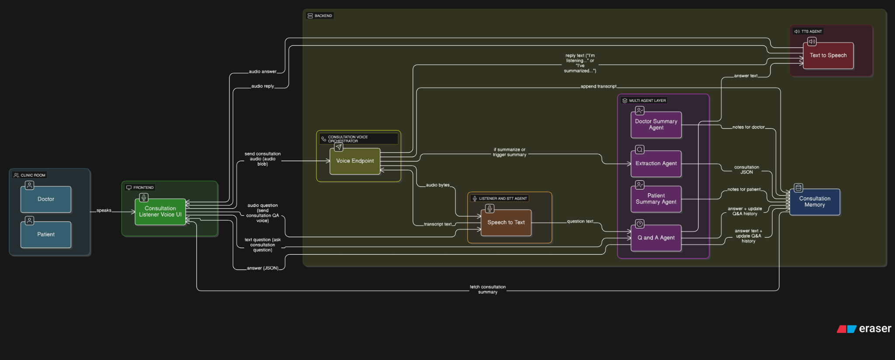

# AI Consultation Listener – Multi-Agent Medical Voice System

> Minimal working prototype for StarPlan Multi-Agent Systems Hackathon

---

## Problem

Patients forget a large part of what doctors say during a visit (diagnosis, how to take meds, warning signs, follow-up).  
Doctors, meanwhile, are overloaded with note-taking and EHR clicks.

Most AI scribes today are **doctor-centric** (only creating notes), leaving the **patient** still confused once they go home.

---

## Solution

**AI Consultation Listener** is a **patient-first, voice-native assistant** for medical consultations.

With patient consent, it:

1. **Listens** to a live doctor–patient visit (voice in via `/consultation/voice`).  
2. **Extracts** a structured `Consultation` JSON (diagnoses, meds, tests, follow-up, red flags).  
3. **Summarizes** into:
   - **Doctor View** – short clinical note (EHR-style).
   - **Patient View** – plain-language explanation & instructions.  
4. Supports **post-visit Q&A** (text or voice) grounded only in that visit’s data via:
   - `/consultation/{id}/qa` (text question → text answer)  
   - `/consultation/{id}/qa/voice` (voice question → voice answer)

---

## MAS Architecture


Below is the final multi-agent architecture used in the AI Consultation Listener prototype:

<p align="center">
  
</p>

### Agents & Roles (Judging: System Design & Collaboration)

The system is implemented as 5 logical agents collaborating over shared state in  
`backend/app/services/consultation_listener_service.py` and  
`backend/app/api/routes/consultation_listener_routes.py`:

1. **Listener / STT Agent**  
   - Implemented by `speech_to_text(...)` using Azure OpenAI Whisper.  
   - Converts uploaded audio (`UploadFile` from `/consultation/voice` and `/qa/voice`) into text.

2. **Voice Gateway / Consultation Orchestrator**  
   - Implemented by the `/consultation/voice` route.  
   - Responsibilities:
     - Create / reuse a `consultation_id` via `get_or_create_consultation(session_id)`.  
     - Call **Listener/STT** to transcribe audio.  
     - Append text into `Consultation.raw_transcript` via `append_transcript(...)`.  
     - Detect when to trigger agents:
       - if `trigger_summary` form field is true, or
       - if transcript contains “summarize”, “we are done”, “finish summary”.  
     - When triggered:
       - call `run_extraction_agent(...)`  
       - call `run_summary_agents(...)`  
     - Return a short **voice reply** using `text_to_speech(...)` plus headers:
       - `X-Session-Id`, `X-Consultation-Id`.

3. **Consultation Extraction Agent**  
   - Implemented as `run_extraction_agent(consultation_id)`.  
   - Input: full `Consultation.raw_transcript`.  
   - Output: a populated `Consultation` Pydantic model (`backend/app/models/consultation.py`):

     ```python
     class Consultation(BaseModel):
         patient_name: Optional[str]
         visit_date: Optional[str]
         diagnoses: List[str]
         symptoms: List[str]
         medications: List[Medication]
         tests: List[str]
         follow_up: Optional[str]
         lifestyle_advice: List[str]
         red_flags: List[str]
         notes_for_doctor: Optional[str]
         notes_for_patient: Optional[str]
         raw_transcript: Optional[str]
         qa_history: List[QAItem]
     ```

   - Uses Azure Chat with `response_format={"type": "json_object"}` and validates via
     `Consultation.model_validate_json(...)`.  
   - Keeps `raw_transcript` from the previous consultation object.

4. **Summarization Agents**  
   - Implemented together in `run_summary_agents(consultation_id)` as **two prompts** over the same Consultation JSON:

   - **Doctor Summary Agent**
     - System prompt: “Doctor Summary Agent” producing a SOAP-style clinical note:
       - Subjective / Assessment / Plan  
       - Includes meds (name, dose, frequency, duration) and follow-up.  
     - Output stored in `Consultation.notes_for_doctor`.

   - **Patient Summary Agent**
     - System prompt: “Patient Summary Agent” at ~8th-grade reading level:  
       - short paragraph about diagnosis and main problem,  
       - “How to take your medicines” bullets,  
       - “Things to watch out for” bullets,  
       - follow-up/tests sentence.  
     - Output stored in `Consultation.notes_for_patient`.

   - Both agents read the *same* serialized JSON (`c.model_dump_json()`) so Doctor View and Patient View stay consistent.

5. **Q&A Agent**  
   - Implemented as `run_qa_agent(consultation_id, question)` plus:
     - `/consultation/{id}/qa` (text in → JSON `{answer}`)  
     - `/consultation/{id}/qa/voice` (audio in → audio answer + headers `X-Question`, `X-Answer`).  
   - Uses:
     - `Consultation` JSON  
     - `Consultation.qa_history` (list of prior Q&A)  
   - Appends each new `QAItem(question, answer)` back into `qa_history`.

   - System prompt explicitly:
     - **Answer ONLY from the consultation JSON.**  
     - If the answer is not clearly in the JSON, reply:  
       > "I'm not sure, this wasn’t clearly discussed in this visit — please confirm with your doctor."

---

### Shared State

All agents share a single in-memory store for the hackathon:

```python
# backend/app/services/consultation_listener_service.py
consultation_memory: Dict[str, Consultation] = {}

# Effectively:
# consultation_memory[consultation_id] = Consultation(...)


